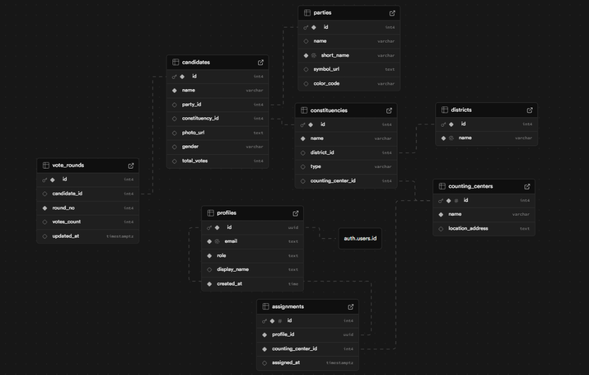

# TN Election Reporting System

A comprehensive Next.js application for managing and visualizing election data, including vote counts, constituencies, parties, and candidates.

## 🚀 Features

### 🔐 Authentication & Security

- **Secure Login**: Email and password authentication powered by Supabase.
- **Password Management**: Forgot checks and reset password functionality.
- **Role-Based Access Control (RBAC)**: Distinct roles for **Admin**, **Informer**, and **User** to control access to features.
- **Protected Routes**: Middleware integration to secure dashboard and management pages.

### 📊 Dashboard & Management

- **Dashboard Overview**: Central hub for election metrics and quick actions.
- **Party Management**:
  - Add, update, and delete political parties.
  - Upload and manage party symbols using **Cloudinary**.
  - Toggle visibility of parties (e.g., hiding "Independent").
- **Constituency Management**:
  - View list of constituencies with search and filter capabilities.
  - Drill down into specific constituency details.
- **Candidate Management**:
  - Register new candidates.
  - Map candidates to specific constituencies and parties.
  - Advanced filtering by district and search by name.
- **User Management**:
  - Create and manage system users.
  - Assign roles (Admin, Informer, User) to control permissions.
- **Assignments**:
  - Assign informers to specific Counting Centers and locations.
  - Manage informer logistics efficiently.

### 🏢 Counting Centers

- Manage counting center locations and details.

## 🛠️ Tech Stack

- **Framework**: [Next.js 15+](https://nextjs.org/) (App Router)
- **Language**: [TypeScript](https://www.typescriptlang.org/)
- **Styling**: [Tailwind CSS](https://tailwindcss.com/) & [Shadcn UI](https://ui.shadcn.com/)
- **State Management**: [Zustand](https://github.com/pmndrs/zustand)
- **Data Fetching**: [TanStack Query](https://tanstack.com/query/latest)
- **Backend / Auth**: [Supabase](https://supabase.com/)
- **Image Storage**: [Cloudinary](https://cloudinary.com/)
- **Forms**: [React Hook Form](https://react-hook-form.com/) & [Zod](https://zod.dev/)

## 📂 Project Structure

```bash
src/
├── actions/            # Server Actions for data mutations (grouped by feature)
│   ├── auth/           # Login, Reset Password actions
│   ├── candidate/      # Candidate management actions
│   ├── party/          # Party CRUD actions
│   └── ...
├── app/
│   ├── (auth)/         # Public authentication routes
│   └── (protected)/    # Protected dashboard routes
├── components/         # Reusable UI components
│   ├── ui/             # Shadcn UI primitives
│   └── [feature]/      # Feature-specific components (e.g., party, user)
├── lib/                # Utilities and configurations
│   ├── supabase/       # Supabase client setup
│   └── cloudinary/     # Cloudinary configuration
└── ...
```

## 🗄️ Database Schema



## ⚙️ Environment Variables

Create a `.env.local` file in the root directory and add the following variables:

```env
# Supabase Configuration
NEXT_PUBLIC_SUPABASE_URL=your_supabase_url
NEXT_PUBLIC_SUPABASE_ANON_KEY=your_supabase_anon_key
SUPABASE_SERVICE_ROLE_KEY=your_service_role_key

# Cloudinary Configuration
CLOUDINARY_CLOUD_NAME=your_cloud_name
CLOUDINARY_API_KEY=your_api_key
CLOUDINARY_API_SECRET=your_api_secret

# Application URL
NEXT_PUBLIC_APP_URL=http://localhost:3000
```

#### 🧑‍💻 Developed and managed by [Hari prasath](https://github.com/hari-prasath-03)
